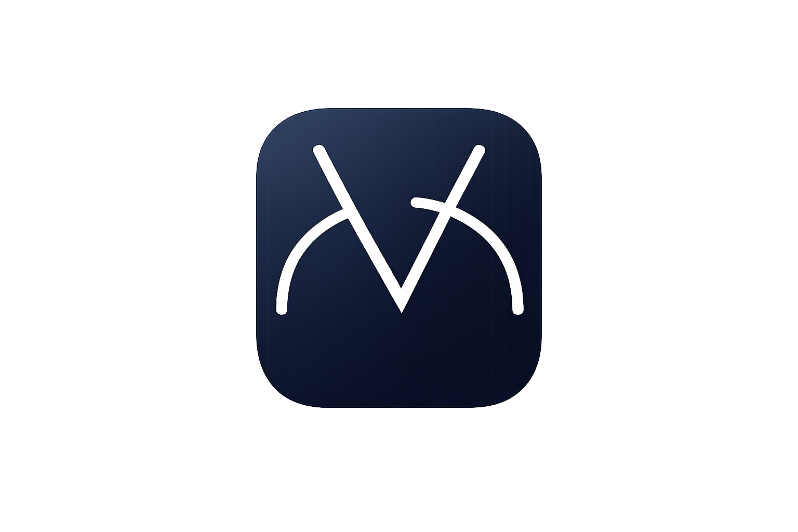

# V-Panel 🔊

**V-Panel** is an elegant floating volume control service for Android. It allows you to manage your device's audio with a stylish on-screen overlay, eliminating the need for physical buttons.

## ✨ Key Features
* 📱 **Floating Overlay**: Always accessible volume panel that stays on top of other apps.
* 🎨 **Minimalist Design**: Clean UI inspired by Material Design principles.
* 🚀 **High Performance**: Ultra-lightweight service with zero ads and minimal battery impact.
* 🛠 **Modern Stack**: Fully written in Kotlin with clean code practices.

## 📥 Installation
You can download the latest APK from the [Releases](https://github.com/tikhontt/phc-vpanel/releases) section.

## 🛠 Setup & Development
To build the project yourself:
1. Clone the repository: `git clone https://github.com/tikhontt/phc-vpanel.git`
2. Open it in **Android Studio**.
3. Go to **Build > Build Bundle(s) / APK(s) > Build APK(s)**.

## 📖 How to Use
Once installed, follow these steps to get V-Panel running:

1. **Grant Permissions**: On the first launch, the app will ask for "Display over other apps" (Overlay) permission. This is required to show the volume panel over your screen.
2. **Start the Service**: Tap the **"Start Service"** button in the app. You will see a small floating icon or handle on the edge of your screen.
3. **Control Volume**: 
    * **Tap** the floating icon to expand the volume slider.
    * **Slide** up or down to adjust the volume level.
    * **Tap outside** or wait a few seconds for the panel to collapse automatically.
4. **Customization**: Use the app's main screen to adjust the position or sensitivity of the floating trigger.

## 📄 License
This project is licensed under the MIT License.
